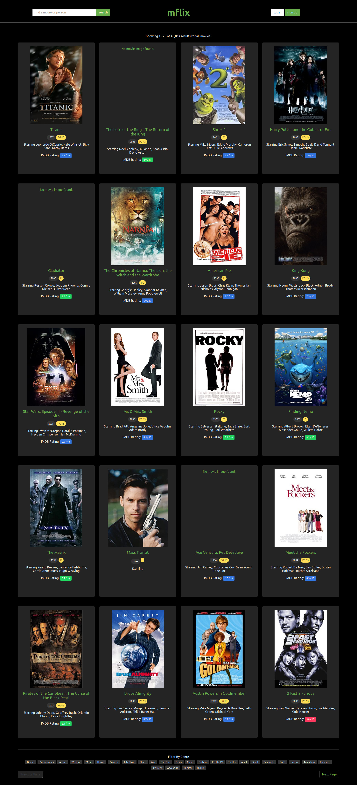

# mflix

This file is a guide to getting started running mflix, an example video
streaming application backed by MongoDB!

## Dependencies

Before install mflix, you'll first need to install some dependencies.

### Anaconda

We're going to use [Anacanoda](https://anaconda.org/) to install Python 3 and
to manage our Python environment.

You can download Anaconda from their [download
site](https://www.anaconda.com/download/#macos). After downloading the
installer you can run it to install Python 3 and Anaconda's command line tools.

### MongoDB

Part of the setup for mflix is to import some data into MongoDB Atlas. To do
this you'll need to have `mongorestore` installed on your computer. This tool
gets installed when you install MongoDB.

If you haven't already installed MongoDB, then follow the instructions in one
of "Installing MongoDB" lectures.

### Python Requirements

Finally, you'll need to install the necessary Python dependencies used by
mflix.

It's best to install these dependencies inside of an Anaconda environment. Go
ahead and download and unzip the attached zip. Inside of your unzipped
directory run the following command to create an Anaconda environment:

```bash
$ conda create -n mflix
```

You can then activate this environment by running:

```bash
$ source activate mflix # on Linux and macOS
$ activate mflix # on Windows
```

Now, from within this environment you can install all your Python dependencies:

```bash
$ pip install -r requirements.txt
```

## MongoDB Atlas

All of the data for this example application is going to be stored in MongoDB.
The easiest way to get up and running with MongoDB is to use MongoDB Atlas, a
fully managed database as a service. With Atlas you can deploy a MongoDB
cluster with just a few clicks.

1. You can create an Atlas Account by going
   [here](https://cloud.mongodb.com/links/registerForAtlas) and filling in the
   required fields.

2. After creating your account you might be asked to name your organization.
   This organization will contain any projects (which contain clusters) in
   Atlas. Use an organization name that will be unique to you.

3. After creating an organization you can create a project for all your
   experimental MongoDB clusters. If you weren't asked to create an
   organization then you weren't prompted to create a project and one was
   automatically created for you.

4. Once you've created a project for experimentation/education you can create a
   cluster for this app. For mflix we'll create a cluster called "mflix". We're
   just experimenting, so we can use a free instance by selecting "M0". You'll
   then need to create an admin username & password for the cluster. Make sure
   to write this down! Finally, you can click "Confirm & Deploy".

5. While your cluster is deploying you can update your IP Whitelist so that
   your app can talk to the cluster. Click the "Security" tab from the
   "Clusters" page. Then click "IP Whitelist" followed by "Add IP Address".
   Finally, click "Allow Access from Anywhere" and click "Confirm".

6. Now that your MongoDB cluster is up and running you can find the connection
   URI that you'll use to connect to it. From the "Clusters" screen you should
   be able to identify your M0 cluster for mflix. From there, click "Connect"
   and on the following screen select "Connect Your Application".

   You'll then be prompted to copy your URI connection string. You should see
   the username of the administrative user you created near the beginning of
   the string. Make sure to replace "<PASSWORD>" with the associated password
   after copying the string. Save this string as you'll use it in the next
   section on importing data.

## Importing Data

After installing all the dependencies and creating your Atlas cluster you can
import the data required by mflix into your cluster.

To import this data you'll first need to paste your connection URI (from the
Atlas UI) into `env.sh` (or `env.bat` on Windows).

After you've update `env.sh` (or `env.bat`) with your Atlas connection URI you
can run `init.sh` (or `init.bat` on Windows) to import all the required data:

```bash
$ ./init.sh # on Linux and macOS
$ init # on Windows
```

## Running the Application

Once your dependencies and data are taken care of you can finally start mflix!

To do this run the following command:

```bash
$ ./run.sh # on Linux and macOS
$ run # on Windows
```

And then point your browser to [http://localhost:5000/](http://localhost:5000/).

From here, you should go ahead and create yourself an account by clicking "sign
up".
